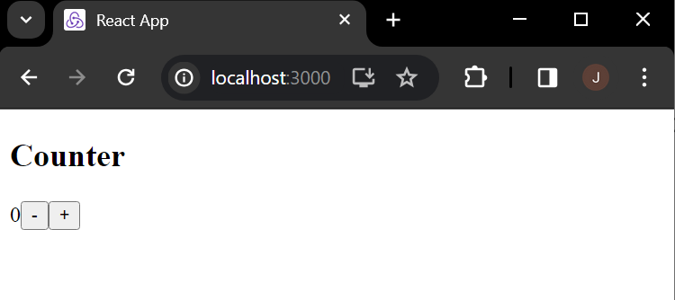
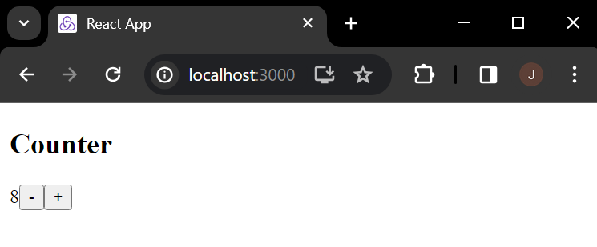
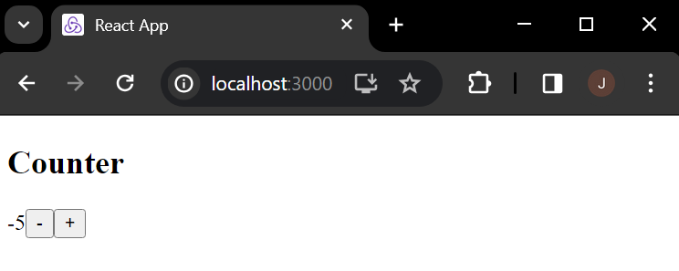

# web603-hw-w6d2

## Getting Started

### Create the App

With `web603-hw-w6d2` as the current directory, run
```bash
$ npx create-react-app redux-counter
```
to create the app "redux-counter".

### Install Dependencies

```
$ npm install redux react-redux @reduxjs/toolkit bootstrap
```

## Test

### App Home (Initial State)


### Increment


### Decrement

